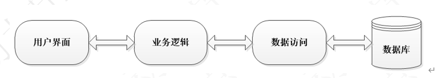

## 软件开发常用结构

### 三层架构
界面层、业务逻辑层、数据访问层

界面层(表示层，视图层):主要功能是接受用户的数据，显示请求的处理结构。

业务逻辑层：接收传递过来的数据，检查数据，计算业务逻辑，调用数据访问层。

数据访问层： 与数据库打交道，实现对数据的增删改查。将存储在数据库中的数据，封装成对象，传递给业务逻辑层。同时将业务逻辑层传递过来的对象，封装成数据库中的数据。

### 常用框架
Mybatis框架： 是一个优秀的基于Java的持久层框架，内部封装了jdbc，开发者只需要关注sql语句，而不需要处理加载驱动、创建连接、关闭连接等繁杂的过程。

Mybatis 通过xml或注解的方式来配置和映射原生信息，将接口和原生SQL语句绑定。通过动态代理的方式创建接口的代理对象，并执行SQL语句，将结果映射成JavaBean返回。

Spring框架：提供了IOC（控制反转）和AOP（面向切面）技术，使开发人员可以更加容易的完成企业级开发。解决了业务对象，功能模块之间的耦合。

SpringMVC框架：是Spring框架的子项目，是Spring框架用来开发Web应用的MVC（模型、视图、控制器）模式的实现。

