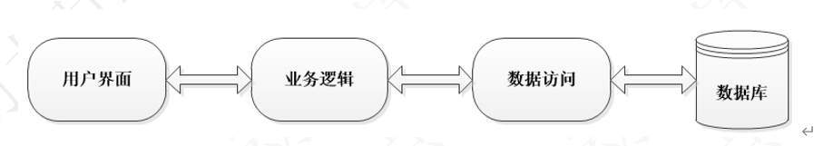

## 软件开发常用结构

### 三层架构
界面层、业务逻辑层、数据访问层

界面层(表示层，视图层):主要功能是接受用户的数据，显示请求的处理结构。

业务逻辑层：接收传递过来的数据，检查数据，计算业务逻辑，调用数据访问层。

数据访问层： 与数据库打交道，实现对数据的增删改查。将存储在数据库中的数据，封装成对象，传递给业务逻辑层。同时将业务逻辑层传递过来的对象，封装成数据库中的数据。



### 常用框架
Mybatis框架： 是一个优秀的基于Java的持久层框架，内部封装了jdbc，开发者只需要关注sql语句，而不需要处理加载驱动、创建连接、关闭连接等繁杂的过程。

Mybatis 通过xml或注解的方式来配置和映射原生信息，将接口和原生SQL语句绑定。通过动态代理的方式创建接口的代理对象，并执行SQL语句，将结果映射成JavaBean返回。

Spring框架：提供了IOC（控制反转）和AOP（面向切面）技术，使开发人员可以更加容易的完成企业级开发。解决了业务对象，功能模块之间的耦合。

SpringMVC框架：是Spring框架的子项目，是Spring框架用来开发Web应用的MVC（模型、视图、控制器）模式的实现。

### ORM概念
ORM(Object Relational Mapping)，即对象关系映射，将对象和关系数据库进行映射，将对象的属性映射到关系数据库的表字段，将对象的方法映射到关系数据库的表字段。

* 数据库的表(table)-->类(class)
* 记录(record，行数据) --> 对象(object)
* 字段(field，列数据) --> 属性(property)

### Mybatis解决的主要问题
减轻使用JDBC的复杂性，不用编写重复的创建Connection、Statement；不用编写关闭资源代码
直接使用java对象，让开发者专注SQL的处理。

### Mybatis的主要作用
1.注册数据库的驱动，例如Class.forName(“com.mysql.jdbc.Driver”))
2. 创建Connection ， Statement， ResultSet对象
3. 从xml中获取sql，并执行sql语句，把ResultSet结果转换java对象
```
List<Student> list = new ArrayList<>();
ResultSet rs = state.executeQuery(“select * from student”);
  while(rs.next){
      Student student = new Student();
      student.setName(rs.getString(“name”));
      student.setAge(rs.getInt(“age”));
      list.add(student);
}
```
4. 关闭连接
```
ResultSet.close() , Statement.close() , Conenection.close()
```

### Mybatis对象分析
### Resource类
Resource类是Mybatis提供的一个类，用来加载配置文件，读取配置文件。

### SqlSessionFactoryBuilder类
SqlsessionFacory的创建，需要使用SqlSessionFactoryBuilder对象的build()方法。由于SqlSessionFactoryBuilder
对象在创建完工厂对象后，就完成了其历史使命，即可被销毁。所以，一般会将该SqlSessionBuilder对象创建为一个方法内的局部对象
方法结束，对象销毁。

### SqlSessionFactory接口
SqlSessionFactory接口对象是一个重量级对象(系统开销大的对象)，是线程安全的，所以一个应用只需要一个该对象即可。
创建SqlSession需要使用SqlSessionFactory接口的openSession()方法。
* openSession(true): 开启自动提交，默认为false，即关闭自动提交。
* openSession(false): 关闭自动提交，即开启自动提交。
* openSession(ExecutorType.BATCH): 开启批处理，即开启自动提交。

### SqlSession接口
SqlSession接口对象用于执行持久化操作，一个SqlSession对应着一次数据库会话，一次会话以SqlSession对象的创建开始
以SqlSession对象的关闭结束。
SqlSession接口对象是线程不安全的，所以每次数据库会话结束前，需要马上调用其close()方法，将其关闭。再次需要会话，再次创建
SqlSession在方法内创建，使用完毕后关闭。

## 深入理解参数
### parameterType
接口中方法参数的类型，类型的完全限定名或别名，这个属性是可选的，因为MyBatis可以推断具体传入语句的参数
默认值设置为unset，接口中方法的参数哦才能够java代码传入到mapper文件的sql语句。
* int 或 java.lang.Integer
* hashmap 或 java.util.HashMap
* list 或 java.util.List
<select>、<insert>、<update>、<delete>都可以使用parameterType指定类型
### 一个参数
Dao接口中方法的参数只有一个简单的类型，例如int、String、Integer、String等。
在mapper文件中，使用#{param}获取参数的值，和方法的参数名无关。
```
//接口方法
Student selectById(int id);

//mapper文件
<select id="selectById" resultType="com.james.domain.Student">
    select * from student where id = #{studentId}  //studentId是自定义的变量名称，和方法参数名无关
<select>
```

### 多个参数-使用@Param
接口中的方法参数有多个，并且参数类型不相同。在方法形参前面加入@Param注解，指定参数的名称。
mapper文件使用#{自定义参数名}

```
//接口方法：
List<Student> selectMutiParam(@Param("PersonName") String name, @Param("PersonAge") int age);

// mapper文件
<select id="selectMutiParam" resultType="com.james.domain.Student">
    select * from student where name = #{PersonName} and age = #{PersonAge}
<select>
```

### 多个参数-使用对象
使用java对象传递参数，java的属性值就是sql需要的参数值，每一个属性就是一个参数。
```
// 创建保存参数值的对象QueryParam
public class QueryParam {
    private String name;
    private int age;
}

//接口方法
List<Student> selectMutiParam(QueryParam param);

// mapper文件
<select id="selectMutiParam" resultType="com.james.domain.Student">
    select * from student where name = #{name} and age = #{age}
<select>

<select id="selectMutiParam" resultType="com.james.domain.Student">
select * from student where name = #{queryName,javaType=java.lang.String, jdbcType=VARCHAR}
 and age = #{queryage, javaType=java.lang.Integer, jdbcType=INTEGER}
```

### 多个参数-使用Map
Map集合可以存储多个值，使用Map向mapper文件一次传入多个参数。Map集合使用String的key，Object类型的值存储参数。
mapper文件使用#{key}引用参数值。

```
接口方法：
List<Student> selectMutiParam(Map<String, Object> map);

mapper文件：
<select id="selectMutiParam" resultType="com.james.domain.Student">
    select * from student where name = #{name} and age = #{age}
<select> 

```

### #和$
#：占位符