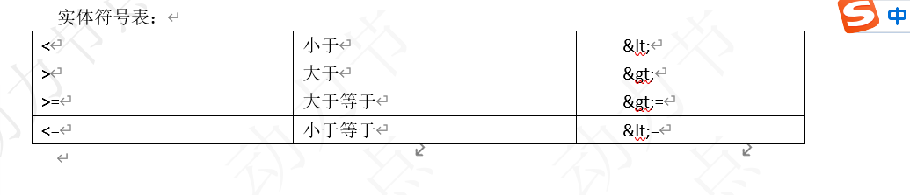

## 环境准备
在mapper的动态SQL中若出现大于号（>）、小于号（<）、大于等于号（>=），小于等于号（<=）等符号，最好将其转换为实体符号。否则，XML可能会出现解析出错问题。
特别是对于小于号（<），在XML中是绝不能出现的。否则解析mapper文件会出错。
实体符号表：


### 动态SQL之if

```
接口方法：
List<Student> selectStudentIf(Student student);

mapper文件：
<select id="selectStudentIf" resultType="com.bjpowernode.domain.Student">
    select id,name,email,age from student
    where 1=1
    <if test="name != null and name !='' ">
        and name = #{name}
    </if>
    <if test="age > 0 ">
        and age &gt; #{age}
    </if>
</select>
```

### 动态SQL之where
```
接口方法：
List<Student> selectStudentWhere(Student student);

mapper文件：
<select id="selectStudentWhere" resultType="com.bjpowernode.domain.Student">
    select id,name,email,age from student
    <where>
        <if test="name != null and name !='' ">
            and name = #{name}
        </if>
        <if test="age > 0 ">
            and age &gt; #{age}
        </if>
    </where>
</select>

```

### 动态SQL之foreach
```
foreach标签用于实现对于数组和集合的遍历。
* collection表示要遍历的集合类型，list、array等
* open、 close、 separator为对遍历内容的SQL拼接

#### （1）遍历List<基本类型>
接口方法：
List<Student> selectStudentForeachList(List<Integer> ids);

mapper文件：
<select id="selectStudentForList" resultType="com.bjpowernode.domain.Student">
    select id,name,email,age from student
    <if test="list !=null and list.size > 0 ">
        where id in
        <foreach collection="list" open="(" close=")" 
				item="stuid" separator=",">
            #{stuid}
        </foreach>
    </if>
</select>

(2) 遍历List<对象类型>
接口方法：
List<Student> selectStudentForList2(List<Student> stuList);

mapper文件：
<select id="selectStudentForList2" resultType="com.bjpowernode.domain.Student">
    select id,name,email,age from student
    <if test="list !=null and list.size > 0 ">
        where id in
        <foreach collection="list" open="(" close=")" 
			item="stuobject" separator=",">
            #{stuobject.id}
        </foreach>
    </if>
</select>
```

### 动态SQL之代码片段
```
<sql/>标签用于定义SQL片断，以便其它SQL标签复用。而其它标签使用该SQL片断，需要使用<include/>子标签。该<sql/>标签可以定义SQL语句中的任何部分，所以<include/>子标签可以放在动态SQL的任何位置。

接口方法：
List<Student> selectStudentSqlFragment(List<Student> stuList);

mapper文件：
<!--创建sql片段 id:片段的自定义名称-->
<sql id="studentSql">
    select id,name,email,age from student
</sql>
<select id="selectStudentSqlFragment" resultType="com.bjpowernode.domain.Student">
    <!-- 引用sql片段 -->
    <include refid="studentSql"/>
    <if test="list !=null and list.size > 0 ">
        where id in
        <foreach collection="list" open="(" close=")" 
			item="stuobject" separator=",">
            #{stuobject.id}
        </foreach>
    </if>
</select>


